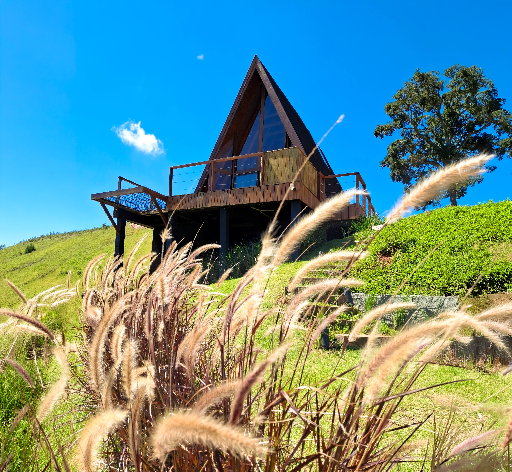

<p align="center">
  
</p>

<h1 align="center">Cabana Quatro Estações</h1>

<p align="center">
  Landing page para a <strong>Cabana Quatro Estações</strong> — um refúgio romântico na Serra do Rio de Janeiro, localizado em Paty do Alferes.
</p>

<p align="center">
  <a href="https://cabana-quatro-estacoes.pages.dev">🔗 Ver o site</a>
</p>

---

## Sobre o Projeto

A Cabana Quatro Estações é uma hospedagem premium em meio à natureza da Serra Fluminense. Este projeto é uma landing page comercial desenvolvida sob demanda para o cliente, com o objetivo de apresentar a cabana, seus diferenciais, depoimentos de hóspedes e facilitar o agendamento de reservas via WhatsApp.

O site foi construído com foco em **performance**, **responsividade** e **conversão**, atendendo a um documento de alinhamento visual com mais de 47 itens de ajuste entre as versões mobile e desktop.

---

## Tecnologias

| Tecnologia | Uso |
|---|---|
| **Next.js 16** | Framework principal (App Router, SSG) |
| **TypeScript** | Tipagem estática em todo o projeto |
| **Tailwind CSS v4** | Estilização utility-first |
| **shadcn/ui** | Componentes acessíveis (Dialog, Carousel, Calendar, Sheet) |
| **Embla Carousel** | Engine dos carrosséis de imagens |
| **react-day-picker** | Seleção de datas com range e dropdown de meses |
| **Cloudflare Pages** | Hospedagem com bandwidth ilimitado e deploy automático |

---

## Desafios

### Responsividade extrema com dois layouts distintos
### Carrosséis com altura consistente
### Overlays decorativos bloqueando interação
### Deploy com imagens pesadas
### Migração de plataforma de hospedagem
---
## Soluções Técnicas
### Imagens responsivas por breakpoint
```tsx
<Image src={item.image_mobile} className="object-cover block md:hidden" />
<Image src={item.image_desktop} className="object-cover hidden md:block" />
```
### Altura fixa em carrosséis
### `pointer-events-none` em overlays
### Compressão e conversão de imagens
### BookingDialog como componente único
### Edge Runtime para Cloudflare Pages
---
## Estrutura do Projeto
```
app/
├── components/
│   ├── sections/           # Seções da landing page
│   │   ├── Hero.tsx
│   │   ├── About.tsx
│   │   ├── Structure.tsx
│   │   ├── Differentials.tsx
│   │   ├── Partnerships.tsx
│   │   ├── Location.tsx
│   │   ├── Testimonials.tsx
│   │   ├── Availability.tsx
│   │   └── Team.tsx
│   └── ui/                 # Componentes reutilizáveis
│       ├── BookingDialog.tsx
│       ├── Navbar.tsx
│       ├── Footer.tsx
│       └── WhatsAppButton.tsx
├── api/
│   └── webhook/route.ts
├── page.tsx
├── layout.tsx
└── globals.css
lib/
├── constants.ts
└── utils.ts
```
---
## Deploy
O projeto é deployado automaticamente via **Cloudflare Pages** a cada push na branch `main`.

🔗 **Produção:** [cabana-quatro-estacoes.pages.dev](https://cabana-quatro-estacoes.pages.dev)

---

## Desenvolvido por
**Pedro Hammes**
Desenvolvedor Web Freelancer

---

<p align="center">
  <sub>© 2026 — Cabana Quatro Estações. Todos os direitos reservados.</sub>
</p>
